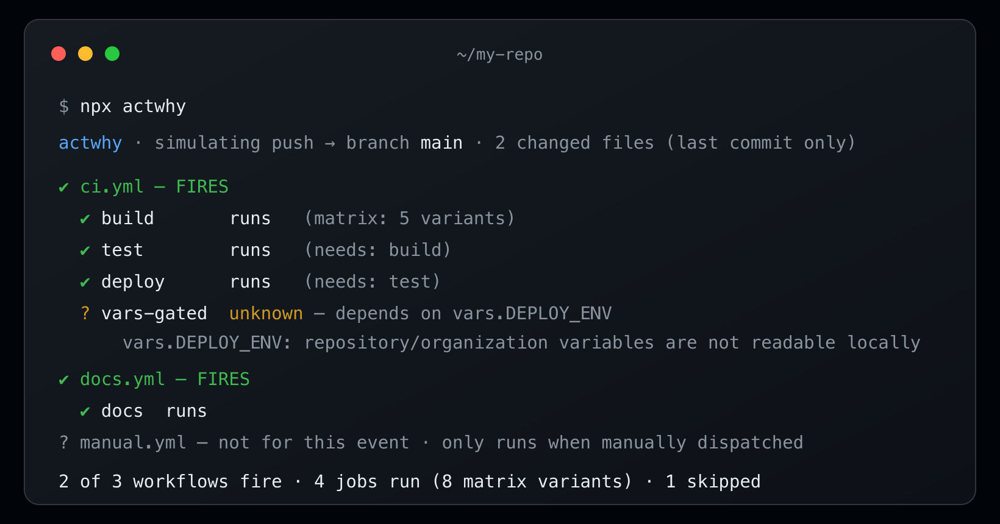

# actwhy

**Know which GitHub Actions workflows will fire — and exactly why the others won't — before you push.**

[](https://github.com/Co-Messi/actwhy/actions/workflows/ci.yml)
[](LICENSE)
[](https://nodejs.org)

`act` executes your workflows (heavy, needs Docker, breaks on runner mismatches). `actionlint` lints their syntax. GitHub's own UI only explains what fired *after* you push. **actwhy** answers a different question — *for this exact push or PR, which workflows fire, which are skipped and by which filter, and which can't be decided offline* — statically, instantly, and with zero network calls.

It never guesses. Every workflow gets one of three verdicts: **FIRES**, **SKIPPED** (with the failing filter quoted in plain English), or **UNKNOWN** (naming the exact runtime-only value it would need, such as `secrets.*` or `needs.*.outputs.*`, and how to supply it).



> Try it with no install in the browser: **[actwhy.vercel.app](https://actwhy.vercel.app)** — paste a workflow, pick an event, see the verdicts.

## The killer case GitHub can never show you

You push to `feat/login`, wait for CI, and nothing happens. No error, no annotation — just silence. actwhy tells you *why* before you push:

```text
⚠ NOTHING fires for this push.
  closest miss: ci.yml — branch filter ["main", "releases/**"] does not match "feat/login"
```

## 30-second quick start

```bash
# In any repo with a .github/workflows/ directory:
npx actwhy                       # infers branch + outgoing changed files from git
npx actwhy pr --base main        # simulate the same changes as a pull request
```

Or install it:

```bash
npm install -g actwhy
actwhy --help
```

> **Not on npm yet?** actwhy publishes to npm immediately after launch. Until then, install
> from source: `git clone https://github.com/Co-Messi/actwhy && cd actwhy && npm install && npm run build`,
> then run `node dist/actwhy.js` (or `npm link` to expose the `actwhy` command).

Requires **Node.js ≥ 20**.

## What it looks like

A normal run — some fire, some are skipped with the exact reason, some aren't for this event:

```text
actwhy · simulating push → branch main · 1 changed file (vs upstream origin/main)

✔ docs.yml — FIRES
✘ ci.yml — skipped
    paths filter ["src/**", "package.json"] matches none of the 1 changed file
? nightly.yml — not for this event
    this workflow only runs manually or on a schedule

1 of 3 workflows fire · 1 job runs · 2 skipped
```

And the case above, where the closest miss is surfaced so you know which filter to fix:

```text
⚠ NOTHING fires for this push.
  closest miss: ci.yml — branch filter ["main", "releases/**"] does not match "feat/login"
```

## Why actwhy

- **It closes the push-blind debug loop.** No more "push, wait, read logs, tweak a filter, push again." The answer is in your terminal before the commit leaves your machine.
- **It never guesses.** A value it cannot know offline (a secret, a needed job's output) becomes an honest `UNKNOWN` naming that value — not a fabricated pass or fail.
- **It quotes the exact filter that decided the outcome.** Not "skipped" — *"branches filter `["main"]` does not match `feat/login`"*.
- **It uses GitHub's own parsing and expression semantics.** Workflow parsing and expression coercion run on GitHub's MIT-licensed [`@actions/workflow-parser`](https://github.com/actions/languageservices) and [`@actions/expressions`](https://github.com/actions/languageservices) — the libraries behind the official Actions language services, not a reimplementation.
- **It gets filter patterns right.** GitHub's `?` and `+` are regex-style quantifiers on the *preceding character*, not glob wildcards — a distinction most third-party matchers get wrong. actwhy implements GitHub's exact semantics, including `!` negation ordering.
- **It catches the classic always-true footgun.** `if: ${{ github.ref }} == 'refs/heads/main'` renders to a non-empty string and is *always* truthy — actwhy warns instead of letting it silently pass.
- **It runs fully local.** Zero network calls, zero telemetry. It reads your workflow files and git metadata, nothing else.

## How it compares

actwhy does not replace any of these tools — it answers a question none of them answer before you push.

| | actwhy | act | wrkflw | actionlint | GitHub post-push logs |
|---|---|---|---|---|---|
| Explains **why** each workflow fires or skips, pre-push | Yes — quotes the exact filter/condition | No | Partially — validates and simulates execution, not per-filter explanations | No | No — only after the push |
| Executes workflows | No | Yes | Yes (local runtime) | No | Yes |
| Lints workflow syntax | No | No | Validates | Yes | Surfaces some errors at run time |
| Needs Docker / a runtime | No | Yes | Docker or emulation | No | No (runs on GitHub's infrastructure) |
| Works offline | Yes | Needs the Docker daemon; pulls runner images on first use | Mostly | Yes | No |

`act -n` (dry run) and `act -l` list jobs for an event, but they don't evaluate
your actual push's branch/paths against the filters, and they can't tell you
*why* something didn't match. That "why" is the entire point of actwhy.

## CLI reference

actwhy has two subcommands. `push` is the default when you run `actwhy` with no subcommand.

### `actwhy push`

Simulate a push. With no flags it infers the current branch and the outgoing changed files from git (your branch vs its upstream).

| Flag | Description |
|---|---|
| `-b, --branch <name>` | Branch to simulate. Default: the current git branch. |
| `--tag <name>` | Simulate a tag push instead of a branch (mutually exclusive with `--branch`). |
| `-f, --files <list>` | Changed files, comma-separated (repeatable). Default: inferred from git. |
| `-m, --commit-message <msg>` | Commit message, for conditions that read `github.event.head_commit.message`. |
| `--event <file>` | Supply an event payload JSON *file* to resolve values actwhy cannot infer offline. |
| `--json` | Emit the full report as JSON for scripting. |
| `--steps` | Include step-level `if:` evaluation in the output. |
| `--exit-code` | Exit non-zero for CI gating: `3` if any workflow is invalid, `4` if nothing fires (default: always exit `0`). |
| `-C, --repo <path>` | Path to the repository. Default: the current directory. |
| `--no-color` | Disable ANSI color. |

### `actwhy pr`

Simulate a pull request against a base branch.

| Flag | Description |
|---|---|
| `--base <branch>` | Base (target) branch — what `branches:` filters match against. Default: the repo's default branch (else `main`). |
| `--head <branch>` | Head (source) branch. Default: the current git branch. |
| `--type <activity>` | Activity type to simulate (`opened`, `synchronize`, `reopened`, …). Default: `opened`. |
| `--draft` | Simulate a draft pull request. |
| `--target` | Simulate `pull_request_target` instead of `pull_request`. |

`pr` also accepts the shared flags `-f/--files`, `-m/--commit-message`, `--event`, `--json`, `--steps`, `-C/--repo`, and `--no-color`, with the same meaning as above.

> `--event <file>` supplies a *payload file* to fill in runtime-only values — it is not the event
> *type*. Use `--target` to switch the event to `pull_request_target`, and `--type` to set the
> activity type.

## How it works

- **Three-valued verdicts.** Each workflow and job resolves to `FIRES`, `SKIPPED`, or `UNKNOWN`. `SKIPPED` always carries the exact failing filter or subexpression; `UNKNOWN` always names the runtime-only value it lacks and how to supply it (`--event payload.json`). actwhy never fabricates a pass or fail.
- **GitHub's own libraries.** Parsing and expression coercion run on GitHub's MIT-licensed `@actions/workflow-parser` and `@actions/expressions`, so the grammar, type coercion, and function semantics match what GitHub actually does — this is GitHub's code, not a reimplementation.
- **An exact filter-pattern engine.** `*` and `**`, character classes `[…]`, `!` negation (order-sensitive), and — critically — the regex-style quantifiers `?` (zero or one of the *preceding* character) and `+` (one or more of the *preceding* character), which standard glob libraries misinterpret as wildcards.
- **Kleene (three-valued) logic.** Unknowns propagate only when they change the outcome. `<unknown> && false` is still a decisive `SKIPPED`; `<unknown> || true` is still `FIRES`. A verdict becomes `UNKNOWN` only when the unknown genuinely decides it.

For the precise boundaries of v0.1 — which events are evaluated versus classified, and what actwhy reports instead of guessing — see **[docs/limitations.md](docs/limitations.md)**.

## Verified against real GitHub

Before release, we pushed 11 crafted workflows and 12 ref events (commits with
disjoint changed-file sets, seven branches probing the pattern grammar, one tag)
to a scratch GitHub repository and recorded which workflows GitHub actually ran.
GitHub started **24 workflow runs across those 12 events — actwhy predicted
exactly those 24 and none of the ~130 other workflow×event combinations, and
all 3 job-level `if:` decisions matched** — including the `?`/`+` quantifier semantics,
`!` negation re-includes, `paths-ignore`'s all-files rule, tag-push versus
branch-filter interplay, and the always-true `if:` footgun (GitHub really does
run that job). The raw Actions API data and the case-by-case table live in
[`test/golden/`](test/golden/README.md). Found a case where actwhy disagrees
with GitHub? That's a P1 bug — please file a
[fidelity report](.github/ISSUE_TEMPLATE/fidelity_report.yml).

## Playground

The [web playground](https://actwhy.vercel.app) runs the exact same core, compiled for the browser. Paste a workflow, choose an event (push or pull request), set a branch and changed files, and see the verdict tree live — including the always-true `if:` footgun warning. It is fully static and client-side: nothing you paste leaves your browser.

## Roadmap

Planned after v0.1 (contributions welcome — see the [starter issues](.github/STARTER_ISSUES.md)):

- **`schedule` evaluation** with cron parsing and next-fire times.
- **`workflow_call` graph expansion** for reusable workflows.
- **`--diff ref..ref`** mode to simulate an arbitrary range instead of the working tree.
- **CI annotation mode** — post a comment or annotation describing what a merge would trigger.

## Contributing

actwhy is fidelity-first: every verdict must be defensible against real GitHub behavior. See **[CONTRIBUTING.md](CONTRIBUTING.md)** for dev setup, the project map, and how to add a filter-semantics test. Fidelity reports — cases where actwhy disagrees with what GitHub actually did — are especially valuable; there is a [dedicated issue template](.github/ISSUE_TEMPLATE/fidelity_report.yml) for them.

## Security

actwhy runs entirely on your machine (CLI) or entirely in your browser (playground). It makes zero network calls at runtime, has zero telemetry, and never reads tokens or secrets — `secrets.*` are treated as `UNKNOWN` by design. See **[SECURITY.md](SECURITY.md)** to report a vulnerability.

## License

[MIT](LICENSE) © 2026 Brayden Siew.
